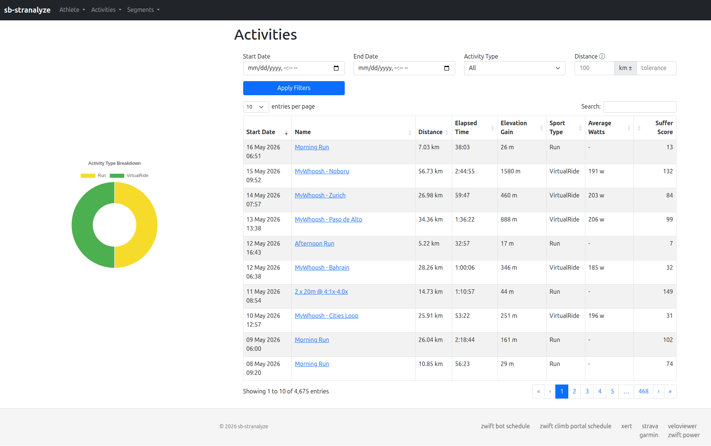
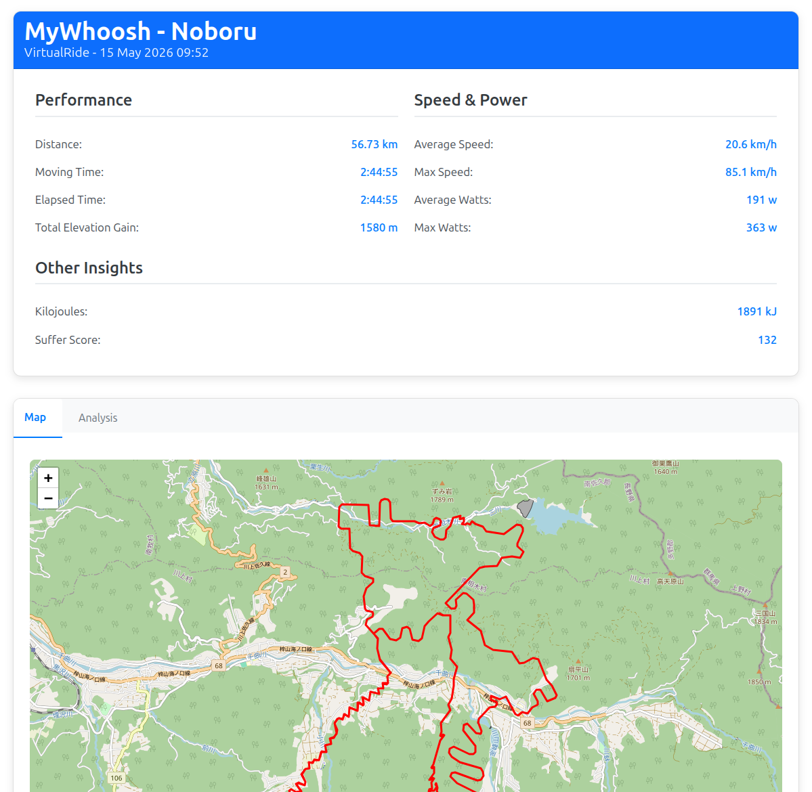
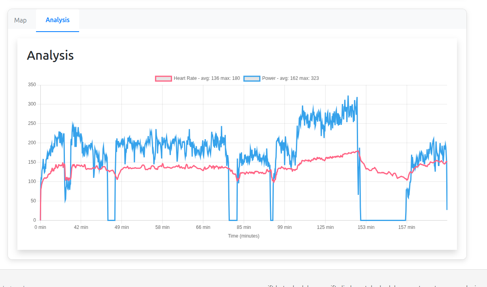
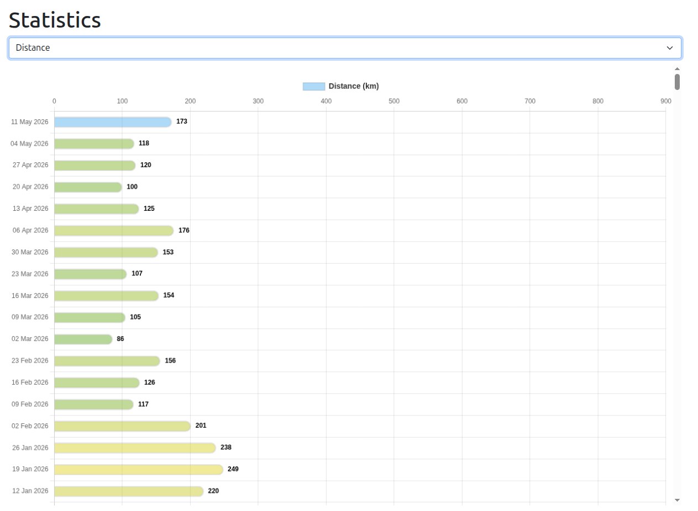
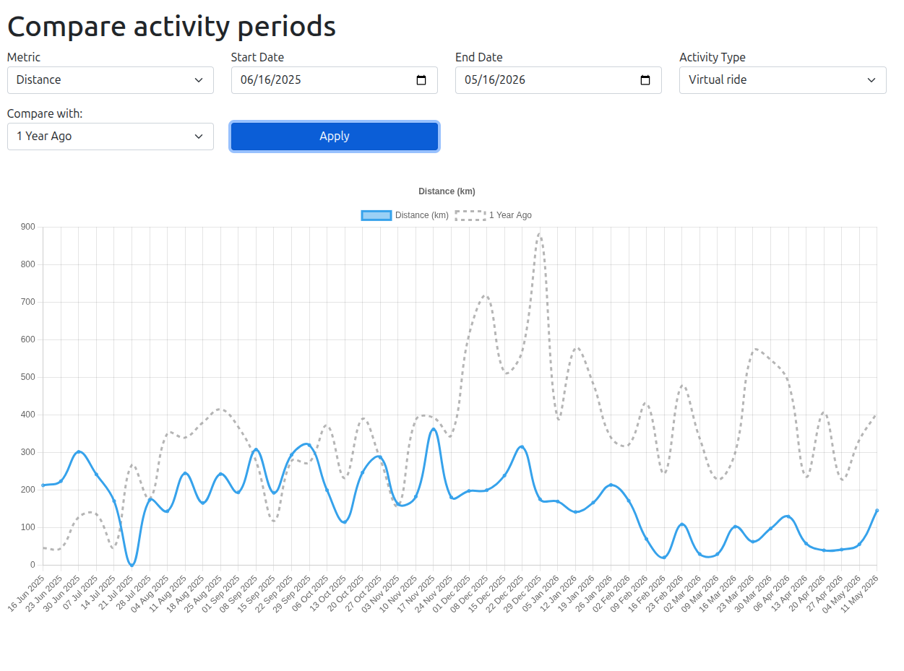

### Spring boot Strava
A spring boot app that taps into your Strava details showing activity details, statistics and comparisons.

### Activities

### Activity details

### Statistics

### Comparisons

Build the app and database with:

`./startup.sh`

Startup options

    -c, --clean   Perform a gradle clean before building
    -r, --remove  Remove Docker images before building
    -d, --removeData Remove database volume
    -h, --help    Display this help message